# 🛡️ Distributed Host Integrity Monitoring Platform (DHIMP)

[](https://www.python.org/)
[](https://virustotal.github.io/yara/)
[](https://manpages.ubuntu.com/manpages/trusty/man8/auditd.8.html)
[](https://www.gnu.org/software/bash/)
[](https://www.sqlite.org/)
[](https://www.django-rest-framework.org/)
[](https://nextjs.org/)
[](https://www.typescriptlang.org/)
[](https://tailwindcss.com/)
[](https://jwt.io/)
[](https://www.docker.com/)
[](https://prometheus.io/)
[](https://grafana.com/)
[](https://github.com/features/actions)
[](https://www.ansible.com/)
[](https://trivy.dev/)
[](https://aws.amazon.com/ec2/)

> **Disclaimer**: This project is for portfolio and showcase purposes only. It demonstrates the design and logic of a Distributed Host Integrity Monitoring Platform but requires additional hardening for production use.

## 📖 Overview

The **Distributed Host Integrity Monitoring Platform (DHIMP)** is a scalable security solution designed to monitor the integrity of files across multiple distributed servers from a single viewpoint.

The system uses a decentralized architecture where each monitored server functions as an independent unit containing its own **Agent** and **Backend Aggregator**. A **Centralized Dashboard** then connects to these distributed units, allowing administrators to monitor security events across the entire infrastructure through a single "Single Pane of Glass" interface.

## 🏗️ Architecture

Each monitored server operates as a self-contained unit (Agent + Backend + Infra). The Centralized Dashboard aggregates data from all these sources.


### 🌍 Distributed Network Topology

While the diagram above shows the internal logic of a single server, the diagram below illustrates how the **Centralized Dashboard** connects to multiple distributed nodes to form a unified monitoring network.

```mermaid
graph TD
   User(("👤 Security Admin"))

    subgraph "Central Command (SaaS Layer)"
        Dashboard["🖥️ Next.js Dashboard"]
    end

    subgraph "Distributed Edge Infrastructure"
        direction LR
        NodeA["Server A"]
        NodeB["Server B"]
        NodeC["Server C"]
        NodeD["Server D"]
    end

    %% Flows
    User ==> Dashboard
    Dashboard -- "1. Aggregated Query (HTTPS)" --> NodeA
    Dashboard -- "2. Aggregated Query (HTTPS)" --> NodeB
    Dashboard -- "3. Aggregated Query (HTTPS)" --> NodeC
    Dashboard -- "4. Aggregated Query (HTTPS)" --> NodeD

    linkStyle 1,2,3,4 stroke:#2980b9,stroke-width:2px;
```



## 📂 Project Structure

```bash
.
├── agent/                         # [PER-SERVER] Host IDS Agent
│   ├── config/                    # Configuration templates
│   │   ├── crontab.example        # Example Cron jobs
│   │   └── incrontab.example      # Example Incron rules
│   ├── rules/                     # Detection Rules
│   │   └── yara-rules.yar         # YARA definitions for malware scanning
│   ├── src/
│   │   └── agent.py               # Main Logic: Watcher -> Audit -> YARA -> API
│   ├── requirements.txt           # Python dependencies (requests, yara-python)
│   └── README.md
│
├── backend/                       # [PER-SERVER] Local Data Aggregator
│   ├── api/                       # API Application
│   │   ├── views.py               # Endpoints (Ingest, Analytics)
│   │   ├── models.py              # DB Schema (FimLog)
│   │   ├── serializers.py         # Data Validation
│   │   └── urls.py                # Router
│   ├── backend/                   # Project Settings
│   │   └── settings.py            # Django Config (SQLite, JWT)
│   ├── docker-compose.yml         # Services: Backend, Prometheus, Grafana, Node-Exporter
│   ├── Dockerfile                 # Gunicorn Production Build
│   └── manage.py
│
├── frontend/                      # [CENTRALIZED] Analytical Dashboard
│   ├── src/
│   │   ├── app/                   # Next.js App Router (Dashboard, Login)
│   │   ├── components/            # UI Components (Visx Charts, Lucide Icons)
│   │   └── lib/                   # Utils
│   ├── public/                    # Static Assets
│   ├── Dockerfile                 # Production Docker Build
│   ├── next.config.ts             # Next.js Config
│   ├── tailwind.config.js         # Styling Config
│   └── package.json
│
├── infra/                         # Deployment Automation
│   ├── deploy-backend.yml         # Ansible Playbook for Backend
│   └── inventory.ini              # Server Inventory
│
└── monthly-reports/                # Reporting Assets
```

## ✨ Key Features

### 🔍 Advanced Detection & Forensics

- **Host-Based Real-time Agent**: Built on Python & Linux Auditd to capture granular forensic details (User ID, Process Name, Working Directory). Implements **Context-Aware Filtering** to distinguish anomalies based on operational hours.
- **Hybrid Threat Detection**: Combines **Behavioral Analysis** with **YARA Content Inspection** to detect complex attack patterns like RCE, PHP Webshells, and Obfuscated Code.
- **Offline Data Resilience**: Integrated **SQLite local buffering** to prevent log loss during network instability, with automated re-sync mechanisms.

### ⚡ Distributed Architecture & Security

- **Independently Operable Backends**: Distributed Django architecture where each node operates independently, secured by **Shared-Secret JWT Authentication**.
- **Hardened Monitoring Stack**: Containerized Prometheus & Grafana with **Localhost Binding (127.0.0.1)**, enforcing access exclusively via secure SSH Tunnels.
- **Autonomous Watchdog & Health**: Real-time Incron monitoring and Cron-based self-healing routines to ensure 99.9% service uptime on edge nodes.

### 📊 Centralized Control & Visualization

- **Unified Dashboard (Single Pane of Glass)**: Next.js interface featuring **Multi-Server API Aggregation** for real-time monitoring of global nodes in a single session.
- **Automated Data Lifecycle**: Docker-based Cron jobs for **Monthly Archival & Auto-Purging**, maintaining peak database performance by offloading historical data to CSV.

### 🏗️ DevOps & Automation

- **Deep-Clean CI/CD Pipeline**: GitHub Actions & Ansible strategy featuring autonomous dependency handling and **Docker Residue Cleanup** for stable deployments.
- **Shift-Left Security**: Integrated **Trivy Vulnerability Scanner** with a **Zero-Tolerance Policy** for Critical/High vulnerabilities during the build phase.

## 🛠️ Tech Stack

### 1. Core Agent & Forensics

- **Python 3**: The core runtime for the agent logic.
- **YARA**: Embedded malware analysis engine for signature-based detection.
- **Cron**: Manages automated system tasks and maintenance to ensure high availability and data integrity.
  - **Watchdog Mechanism**: Periodic health-checks and self-healing for Incron and Auditd services.
  - **Automated Maintenance**: Monthly service rotation and physical monitoring integrity tests.
  - **Data Retention Policy**: Monthly automated log archival to CSV and database cleanup via Django management commands.
- **Incron**: Uses `inotify` triggers for real-time file system monitoring.
- **Linux Auditd**: Captures deep forensic data (User ID, Process Name) via syscalls.
- **Bash Scripting**: Used for self-healing and service recovery mechanisms.
- **SQLite**: Provides local buffering to ensure no logs are lost during network outages.

### 2. Full-Stack Development

- **Django REST Framework**: High-performance edge backend for data aggregation.
- **Next.js**: The framework for the Centralized Dashboard (Single Pane of Glass).
- **TypeScript**: Ensures type safety and code quality across the frontend.
- **Tailwind CSS**: Utility-first CSS framework for rapid and responsive UI design.
- **JWT (Shared-Secret)**: Secure cross-server authentication mechanism.

### 3. DevOps & Infrastructure

- **Docker**: Containerization for consistent deployment across all environments.
- **Prometheus & Grafana**: Complete infrastructure monitoring stack.
- **GitHub Actions**: Automated CI/CD pipelines for testing and deployment.
- **Ansible**: Configuration management for mass-deployment of agents.
- **Trivy**: Vulnerability scanning to ensure secure container images.
- **AWS EC2**: The production environment hosting the distributed nodes.

---

## 🚀 Getting Started

### 1. Deploying a Server Unit (Agent + Backend)

Run this on **each** server you want to monitor.

```bash
# 1. Clone & Configure Infra
cd infra
ansible-playbook -i inventory.ini deploy-backend.yml

# 2. Manual Start (if not using Ansible)
cd backend
docker-compose up -d --build
```

_This starts the Local Backend Aggregator (Gunicorn/Django) and Monitoring Stack (Prometheus/Grafana)._

### 2. Configure the Agent (Host IDS)

Run these steps on the same monitored server:

#### A. Install Dependencies

```bash
cd agent
pip install -r requirements.txt
# Ensure dependencies like yara-python and requests are installed
```

#### B. Setup File Watching (Incron)

Trigger the agent immediately upon file events.

```bash
# 1. Install Incron
sudo apt install incron
echo "root" >> /etc/incron.allow

# 2. Add Rule (Edit with: sudo incrontab -e)
# Format: <Directory> <Events> <Command>
/var/www/html IN_MODIFY,IN_CREATE,IN_DELETE /usr/bin/python3 /path/to/agent/src/agent.py $@/$# $%
```

#### C. Setup Automated Maintenance (Crontab)

Ensure self-healing and periodic health checks.

```bash
# Edit crontab: sudo crontab -e

# 1. Check Incron Status (Every 2 mins) - Reports to Dashboard
*/2 * * * * /path/to/agent/scripts/check_incron.sh /tmp/incron_status.txt

# 2. Self-Healing Auditd (Every 5 mins) - Restarts daemon if crashed
*/5 * * * * /path/to/agent/scripts/auditd_healer.sh >> /var/log/fim_healer.log 2>&1

# 3. Monthly Deep Maintenance (1st of Month) - Log rotation & Integrity Test
0 3 1 * * /path/to/agent/scripts/maintain_auditd.sh
```

#### D. Verify Agent Configuration

Edit `agent/src/agent.py` to point to your local backend:

```python
API_INGEST_URL = "http://127.0.0.1:8000/api/ingest/fim/"
```

### 3. Deploy Centralized Dashboard

Run this once on your admin machine or central server.

```bash
cd frontend
cp .env.local.example .env.local
```

Edit `.env.local` to list all your monitored servers:

```env
NEXT_PUBLIC_API_MAIN=https://server1.com/api
NEXT_PUBLIC_API_SERVER2=https://server2.com/api
NEXT_PUBLIC_API_SERVER3=https://server3.com/api
```

Start the dashboard:

```bash
npm install
npm run dev
# OR with Docker
docker build -t fim-dashboard . && docker run -p 3000:3000 fim-dashboard
```

## ⚠️ Notes

- Ensure the **Centralized Dashboard** has network access to the **Backend Aggregator** ports (default: 8000) on all monitored servers.
- Use HTTPS in production to secure the data in transit between Server Units and the Dashboard.
